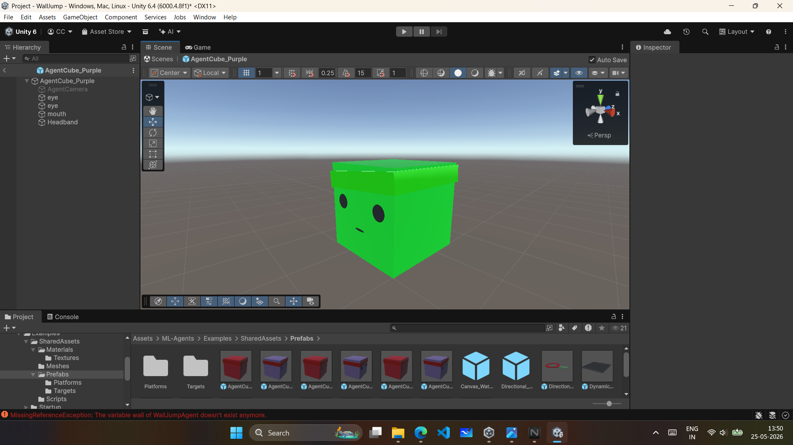
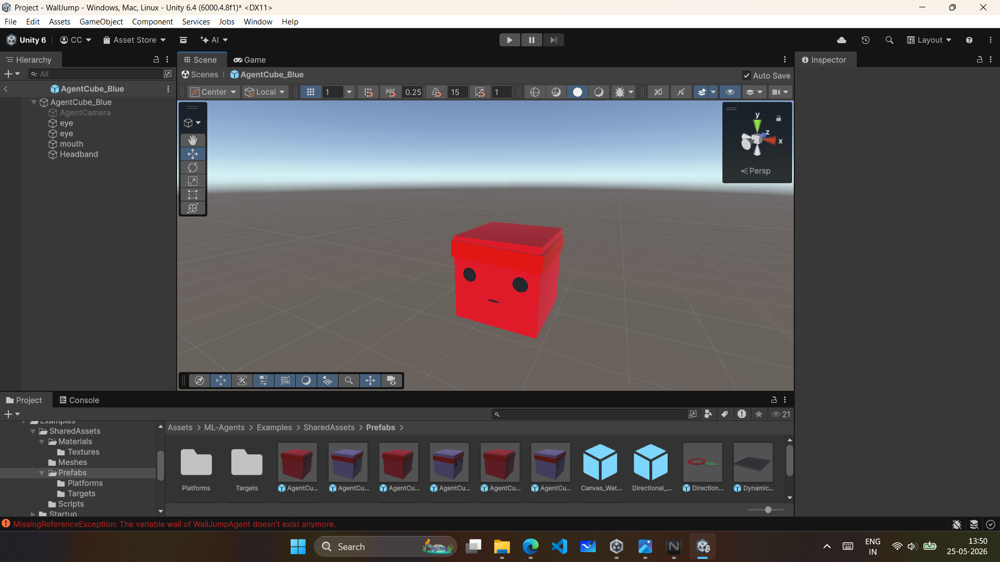

## Screenshots

# AI Hide and Seek using Reinforcement Learning

AI-powered hide and seek simulation developed in Unity using ML-Agents and Proximal Policy Optimization (PPO). The project demonstrates intelligent multi-agent behavior where AI agents learn to hide, seek, navigate, and adapt inside a dynamic environment using reinforcement learning.

---

# Project Overview

This project focuses on creating an intelligent hide-and-seek simulation where multiple AI agents interact inside a Unity environment. The agents are trained using reinforcement learning techniques to develop strategic behaviors over time.


The project was developed as a major academic project to explore:

* Artificial Intelligence in games
* Multi-Agent Reinforcement Learning
* Unity ML-Agents Toolkit
* PPO (Proximal Policy Optimization)
* Agent decision-making systems
* Environment interaction and navigation

---
Educational Purpose and Research Inspiration

This project was developed purely for educational and learning purposes.

The project is inspired by reinforcement learning research and AI hide-and-seek experiments discussed in the AI research community. The objective was to understand and experiment with reinforcement learning systems practically using Unity ML-Agents.

We do not claim that the entire AI architecture or learning framework was created completely from scratch. Instead, the project focuses on:

Understanding reinforcement learning workflows
Experimenting with agent behaviors
Testing AI interaction systems
Learning practical ML-Agent implementation

The project mainly relies on:

Unity ML-Agents
PPO-based reinforcement learning
Environment experimentation
Limited training iterations

Due to hardware and computational limitations, only a smaller amount of training data was generated and used to demonstrate the project prototype.

Although the final system does not fully achieve highly advanced emergent hide-and-seek intelligence, it successfully demonstrates the practical implementation and study of reinforcement learning concepts within Unity.


Reinforcement Learning and AI System Explanation
Reinforcement Learning (RL)

Reinforcement Learning is a machine learning technique where an agent learns by interacting with an environment. Instead of being directly programmed with fixed behaviors, the agent improves over time using rewards and penalties.

In this project:

The environment is created in Unity
The agents interact with objects and obstacles
Rewards encourage useful behavior
Penalties discourage incorrect actions

The AI gradually learns movement and decision-making patterns through repeated training episodes.

Unity ML-Agents

The project uses the Unity ML-Agents Toolkit, which provides a bridge between Unity and Python-based machine learning training systems.

ML-Agents was used because it allows:

Agent training inside Unity environments
Reinforcement learning integration
Observation and action systems
Real-time AI experimentation
PPO-based training workflows

The toolkit helped in creating AI agents without building the entire reinforcement learning framework from scratch.

PPO Algorithm

The project uses PPO (Proximal Policy Optimization), a reinforcement learning algorithm commonly used for stable AI training.

PPO was selected because:

It provides stable learning updates
It is efficient for continuous training
It works well in dynamic game environments
It is supported directly by Unity ML-Agents

The algorithm continuously updates agent behavior based on rewards received during gameplay interactions.

Python Integration

Python is used for:

Running the training process
Managing reinforcement learning models
Processing observations and rewards
Updating the PPO neural network

The Unity environment communicates with Python during training using the ML-Agents framework.

Training is heavily dependent on:

Hardware capability
Training duration
Amount of generated training data
Environment complexity

Due to hardware limitations and limited training time, only a smaller training dataset and shorter training sessions were generated for demonstration purposes.

Unity GameObjects and Agents

In Unity, the AI characters are implemented using GameObjects combined with ML-Agent components.

Each agent contains:

Rigidbody for movement physics
Agent script for decision-making
Sensors for environment observation
Reward system logic
Action handling system

The environment also contains:

Obstacles
Walls
Navigation areas
Interactive objects
Spawn points

These GameObjects form the training environment where the AI learns through interaction.

Ray Sensors and Observation System

Ray Sensors are used to help agents observe the environment.

Ray sensors work similarly to vision detection:

Rays are projected around the agent
Objects are detected based on distance and direction
Information is converted into observations for the AI model

The agents use ray sensor observations to:

Detect obstacles
Locate opponents
Navigate through the environment
Avoid collisions

This observation data is sent to the PPO model during training.
Agent Training Workflow
Unity Environment
        ↓
ML-Agent observes environment
        ↓
Ray Sensors collect observations
        ↓
Observations sent to PPO model
        ↓
Python training process updates policy
        ↓
Agent receives action
        ↓
Movement and interaction occur
        ↓
Rewards/Penalties assigned
        ↓
Training continues
# Features

## Intelligent AI Agents

* Hider agents learn to survive and avoid detection
* Seeker agents learn to detect and catch hiders
* Agents adapt behavior based on rewards and penalties

## Reinforcement Learning System

* PPO-based training system
* Dynamic reward and penalty mechanism
* Continuous learning through environment interaction

## Multi-Agent Environment

* Multiple agents interact simultaneously
* Competitive AI behavior
* Emergent strategic movement patterns

## Real-Time Training

* Agents improve performance over time
* Real-time observation and learning
* Training statistics monitoring

## Unity Environment Simulation

* Interactive 3D environment
* Physics-based movement and collision detection
* Custom game environment setup

---

# Technologies Used

| Technology           | Purpose                                |
| -------------------- | -------------------------------------- |
| Unity                | Game environment and simulation        |
| C#                   | Game logic and agent scripting         |
| Python               | AI training and reinforcement learning |
| Unity ML-Agents      | Agent training framework               |
| PPO Algorithm        | Reinforcement learning optimization    |
| TensorFlow / PyTorch | Model training backend                 |

---

# System Architecture

```text
Unity Environment
        ↓
   ML-Agents
        ↓
 Observation System
        ↓
 PPO Reinforcement Learning
        ↓
 Reward & Penalty System
        ↓
 Trained AI Models
```

---

# How the AI Works

## Hider Agent

The hider agent learns to:

* Avoid seeker agents
* Use obstacles for cover
* Navigate efficiently
* Survive for maximum duration

## Seeker Agent

The seeker agent learns to:

* Detect hider movement
* Explore the environment
* Track targets efficiently
* Capture hiders quickly

## Reinforcement Learning Process

The agents continuously interact with the environment. Based on actions and outcomes, rewards or penalties are assigned. Over multiple training episodes, agents optimize their behavior using PPO.

---

# PPO Algorithm

The project uses Proximal Policy Optimization (PPO), a reinforcement learning algorithm designed for stable and efficient policy updates.

Key advantages of PPO:

* Stable learning process
* Better convergence
* Efficient policy optimization
* Suitable for multi-agent environments

---

# Reward and Penalty System

| Action                   | Reward/Penalty |
| ------------------------ | -------------- |
| Hider survives longer    | +1             |
| Seeker catches hider     | +2             |
| Collision with obstacles | -1             |
| Inefficient movement     | -0.2           |
| Timeout / failure        | -0.5           |

---

# Training Information

| Parameter            | Value                  |
| -------------------- | ---------------------- |
| Algorithm            | PPO                    |
| Training Environment | Unity ML-Agents        |
| Language             | Python + C#            |
| Agent Type           | Multi-Agent System     |
| Training Mode        | Reinforcement Learning |

---

# Screenshots

## Gameplay Environment


## AI Training Environment

.png)

## Hider and Seeker Agents




## Unity Scene Setup

.png)

---

# Demo Video

Add your project demo video link below:

## Demo Video

[](https://youtu.be/dm_gu3XAAks)
# Installation Guide

## Prerequisites

* Unity Hub
* Unity Editor
* Python
* Unity ML-Agents Toolkit
* Git

## Steps

1. Clone the repository

```bash
https://github.com/chetanchoudhari/Hide-Seek-Using-Reinforcement-Learning/tree/main
```

2. Open the project in Unity Hub

3. Install ML-Agents dependencies

4. Open the training environment scene

5. Run the project or start training

---

# Project Structure

```text
AI-Hide-and-Seek-RL/
│
├── Assets/
├── Packages/
├── ProjectSettings/
├── Screenshots/
├── Videos/
├── Docs/
├── Python/
├── Training/
├── README.md
├── .gitignore
└── LICENSE
```

---

# Challenges Faced

* Designing intelligent multi-agent behavior
* Balancing reward and penalty systems
* Training stability and convergence issues
* Performance optimization during large training sessions
* Environment balancing and AI adaptation

---

# Future Improvements

* Advanced environment generation
* Smarter cooperative agents
* Improved navigation system
* Real-time analytics dashboard
* Online multiplayer AI interaction
* Enhanced visual effects and UI

---

# Learning Outcomes

This project helped in understanding:

* Reinforcement learning concepts
* PPO algorithm implementation
* Multi-agent AI systems
* Unity ML-Agents framework
* AI behavior optimization
* Environment-agent interaction systems
* Python and C# integration

---

# Documentation

Additional project documentation can be added inside the `Docs/` folder.

Example:

```text

Docs/
├── project_report.pdf
├── architecture_diagram.png
└── research_notes.pdf
```

---

# Contribution

Contributions and improvements are welcome.

1. Fork the repository
2. Create a new branch
3. Commit changes
4. Push to branch
5. Open a Pull Request

---

# License

This project is developed for educational and research purposes.

---

# Author

**Chetan Choudhary**

B.Tech CSE Student | Unity Developer | AI & Reinforcement Learning Enthusiast

---

# Support

If you found this project useful, consider giving it a star on GitHub.
