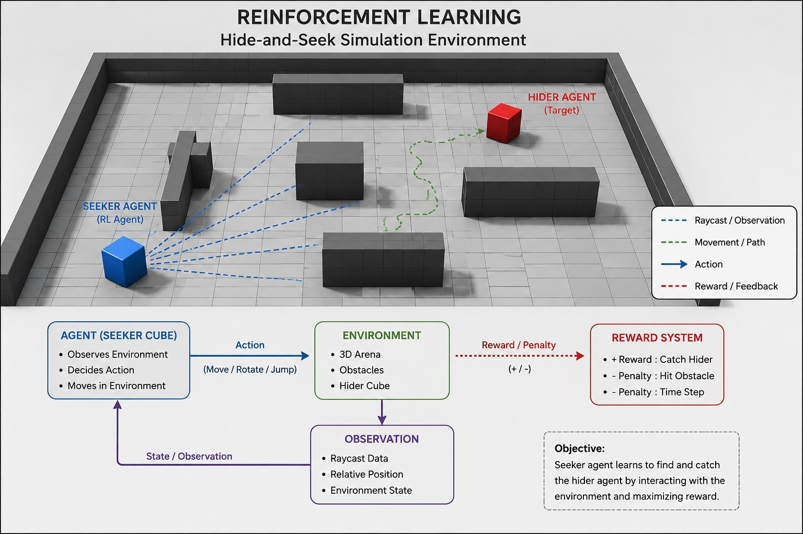
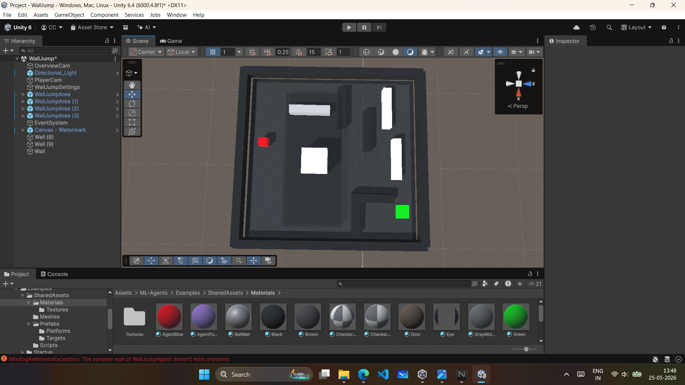

## Screenshots


# AI Hide and Seek using Reinforcement Learning

AI-powered hide and seek simulation developed in Unity using ML-Agents and Proximal Policy Optimization (PPO). The project demonstrates intelligent multi-agent behavior where AI agents learn to hide, seek, navigate, and adapt inside a dynamic environment using reinforcement learning.

---

# Project Overview

This project focuses on creating an intelligent hide-and-seek simulation where multiple AI agents interact inside a Unity environment. The agents are trained using reinforcement learning techniques to develop strategic behaviors over time.

The project was developed as a major academic project to explore:

* Artificial Intelligence in games
* Multi-Agent Reinforcement Learning
* Unity ML-Agents Toolkit
* PPO (Proximal Policy Optimization)
* Agent decision-making systems
* Environment interaction and navigation

---

# Features

## Intelligent AI Agents

* Hider agents learn to survive and avoid detection
* Seeker agents learn to detect and catch hiders
* Agents adapt behavior based on rewards and penalties

## Reinforcement Learning System

* PPO-based training system
* Dynamic reward and penalty mechanism
* Continuous learning through environment interaction

## Multi-Agent Environment

* Multiple agents interact simultaneously
* Competitive AI behavior
* Emergent strategic movement patterns

## Real-Time Training

* Agents improve performance over time
* Real-time observation and learning
* Training statistics monitoring

## Unity Environment Simulation

* Interactive 3D environment
* Physics-based movement and collision detection
* Custom game environment setup

---

# Technologies Used

| Technology           | Purpose                                |
| -------------------- | -------------------------------------- |
| Unity                | Game environment and simulation        |
| C#                   | Game logic and agent scripting         |
| Python               | AI training and reinforcement learning |
| Unity ML-Agents      | Agent training framework               |
| PPO Algorithm        | Reinforcement learning optimization    |
| TensorFlow / PyTorch | Model training backend                 |

---

# System Architecture

```text
Unity Environment
        ↓
   ML-Agents
        ↓
 Observation System
        ↓
 PPO Reinforcement Learning
        ↓
 Reward & Penalty System
        ↓
 Trained AI Models
```

---

# How the AI Works

## Hider Agent

The hider agent learns to:

* Avoid seeker agents
* Use obstacles for cover
* Navigate efficiently
* Survive for maximum duration

## Seeker Agent

The seeker agent learns to:

* Detect hider movement
* Explore the environment
* Track targets efficiently
* Capture hiders quickly

## Reinforcement Learning Process

The agents continuously interact with the environment. Based on actions and outcomes, rewards or penalties are assigned. Over multiple training episodes, agents optimize their behavior using PPO.

---

# PPO Algorithm

The project uses Proximal Policy Optimization (PPO), a reinforcement learning algorithm designed for stable and efficient policy updates.

Key advantages of PPO:

* Stable learning process
* Better convergence
* Efficient policy optimization
* Suitable for multi-agent environments

---

# Reward and Penalty System

| Action                   | Reward/Penalty |
| ------------------------ | -------------- |
| Hider survives longer    | +1             |
| Seeker catches hider     | +2             |
| Collision with obstacles | -1             |
| Inefficient movement     | -0.2           |
| Timeout / failure        | -0.5           |

---

# Training Information

| Parameter            | Value                  |
| -------------------- | ---------------------- |
| Algorithm            | PPO                    |
| Training Environment | Unity ML-Agents        |
| Language             | Python + C#            |
| Agent Type           | Multi-Agent System     |
| Training Mode        | Reinforcement Learning |

---

# Screenshots

## Gameplay Environment


## AI Training Environment


## Hider and Seeker Agents


## Unity Scene Setup


---

# Demo Video

Add your project demo video link below:

```md
https://youtu.be/dm_gu3XAAks
```

```md
https://youtu.be/your-video-id
```

---

# Installation Guide

## Prerequisites

* Unity Hub
* Unity Editor
* Python
* Unity ML-Agents Toolkit
* Git

## Steps

1. Clone the repository

```bash
https://github.com/chetanchoudhari/Hide-Seek-Using-Reinforcement-Learning/tree/main
```

2. Open the project in Unity Hub

3. Install ML-Agents dependencies

4. Open the training environment scene

5. Run the project or start training

---

# Project Structure

```text
AI-Hide-and-Seek-RL/
│
├── Assets/
├── Packages/
├── ProjectSettings/
├── Screenshots/
├── Videos/
├── Docs/
├── Python/
├── Training/
├── README.md
├── .gitignore
└── LICENSE
```

---

# Challenges Faced

* Designing intelligent multi-agent behavior
* Balancing reward and penalty systems
* Training stability and convergence issues
* Performance optimization during large training sessions
* Environment balancing and AI adaptation

---

# Future Improvements

* Advanced environment generation
* Smarter cooperative agents
* Improved navigation system
* Real-time analytics dashboard
* Online multiplayer AI interaction
* Enhanced visual effects and UI

---

# Learning Outcomes

This project helped in understanding:

* Reinforcement learning concepts
* PPO algorithm implementation
* Multi-agent AI systems
* Unity ML-Agents framework
* AI behavior optimization
* Environment-agent interaction systems
* Python and C# integration

---

# Documentation

Additional project documentation can be added inside the `Docs/` folder.

Example:

```text
Docs/
├── project_report.pdf
├── architecture_diagram.png
└── research_notes.pdf
```

---

# Contribution

Contributions and improvements are welcome.

1. Fork the repository
2. Create a new branch
3. Commit changes
4. Push to branch
5. Open a Pull Request

---

# License

This project is developed for educational and research purposes.

---

# Author

**Chetan Choudhary**

B.Tech CSE Student | Unity Developer | AI & Reinforcement Learning Enthusiast

---

# Support

If you found this project useful, consider giving it a star on GitHub.
